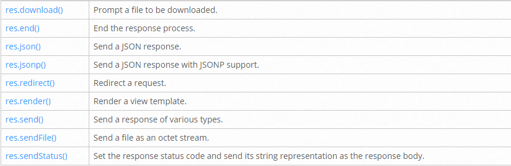

# Express Routing & Connected API

## Review, Research, and Discussion
* Name 3 real world use cases where you’d want to change the request with custom middleware.

1- Security: Authenticates

2- Transaction management

3- Message queues

* True or false: The route handler is middleware?

False

* In what ways can a middleware function end the process and send data to the browser?

Response and return

* At what point in the request lifecycle can you “inject” middleware?

endless

* What can cause express to error with “Request headers sent twice, cannot start a second response”

When we response twice.

## Document the following Vocabulary Terms
* **Middleware**: functions are functions that have access to the request object (req), the response object (res), and the next function in the application’s request-response cycle.
* **Request Object**: The req object represents the HTTP request and has properties for the request query string, parameters, body, HTTP headers, and so on.
* **Response Object**: The res object represents the HTTP response that an Express app sends when it gets an HTTP request.
* **Application Middleware**: Bind application-level middleware to an instance of the app object
* **Routing Middleware**:Router-level middleware works in the same way as application-level middleware, except it is bound to an instance of express.Router().

## Preparation Materials

### Routing
Routing refers to how an application’s endpoints (URIs) respond to client requests

You define routing using methods of the Express app object that correspond to HTTP methods; for example, app.get() to handle GET requests and app.post to handle POST requests. For a full list, see app.METHOD. You can also use app.all() to handle all HTTP methods and app.use() to specify middleware as the callback function (See Using middleware for details).

The following code is an example of a very basic route.

```js
var express = require('express')
var app = express()

// respond with "hello world" when a GET request is made to the homepage
app.get('/', function (req, res) {
  res.send('hello world')
})
```

#### Route methods
A route method is derived from one of the HTTP methods, and is attached to an instance of the express class.

#### Route paths
Route paths, in combination with a request method, define the endpoints at which requests can be made. Route paths can be strings, string patterns, or regular expressions.

#### Route parameters
Route parameters are named URL segments that are used to capture the values specified at their position in the URL. The captured values are populated in the req.params object, with the name of the route parameter specified in the path as their respective keys.

```
Route path: /users/:userId/books/:bookId
Request URL: http://localhost:3000/users/34/books/8989
req.params: { "userId": "34", "bookId": "8989" }
```

#### Route handlers
You can provide multiple callback functions that behave like middleware to handle a request. The only exception is that these callbacks might invoke next('route') to bypass the remaining route callbacks. You can use this mechanism to impose pre-conditions on a route, then pass control to subsequent routes if there’s no reason to proceed with the current route.

A single callback function can handle a route. For example:

```js
app.get('/example/a', function (req, res) {
  res.send('Hello from A!')
})
```

#### Response methods



#### app.route()
You can create chainable route handlers for a route path by using app.route(). 

#### express.Router
Use the express.Router class to create modular, mountable route handlers. A Router instance is a complete middleware and routing system; for this reason, it is often referred to as a “mini-app”.